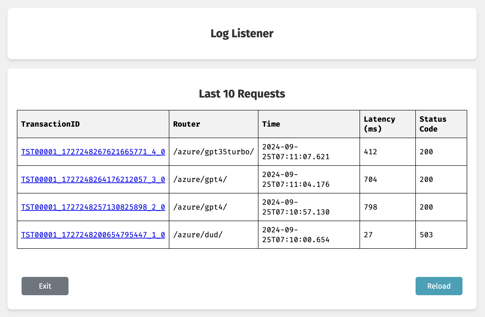

# Broker

## Purpose

The `broker` processor connects to the Gecholog LLM Gateway to load balance over multiple LLM Endpoints (routers in Gecholog) and disables resources from the pool of LLM Endpoints when requests fail. The default behavior is as follows:

- Requests to `/azure/` will be forwarded to either `/azure/gpt35turbo/` or `/azure/gpt4/` or `/azure/dud/`. The order is random.
- If a request is routed to `/azure/dud/` you will receive an error code. From that point `/azure/dud/` is disabled for 10 minutes.

Disabled time can be changed using the `DISABLED_TIME` environment variable. The `/azure/dud/` illustrates what happens if one of the LLM Endpoints fails.

## Building

Before you proceed, build the [gecholog](https://github.com/direktoren/gecholog) container.

Make sure you have (at least) two Azure OpenAI deployments. For example

```sh
  gpt4
  gpt35turbo
```

From this directory, run

```sh
  export NATS_TOKEN=changeme
  export GUI_SECRET=changeme
  export AISERVICE_API_BASE=https://your.openai.azure.com/
  docker compose up -d
```

> NOTE: If you want to use other Azure OpenAI deployments, [log in](http://localhost:8080/login) and update the two routers `/azure/gpt35turbo/` and `/azure/gpt4/` with the correct deployment information.

## Using

```sh
export AISERVICE_API_KEY=your_api_key
```

Let's send a request to the `/azure/` router. Run as many times as you like

```sh
curl -X POST -H "api-key: $AISERVICE_API_KEY" -H "Content-Type: application/json" -d '{
    "messages": [
      {
        "role": "system",
        "content": "Assistant is a large language model trained by OpenAI."
      },
      {
        "role": "user",
        "content": "Who are the founders of Microsoft?"
      }
    ],
    "max_tokens": 15
  }' "http://localhost:5380/azure/"
```

If you get routed to `/azure/gpt4/` or `/azure/gpt35turbo/` you would see a response like this

```json
{
  "id": "chatcmpl-8nZCiOLutrIDeVT94lyXkYzdKtkDe",
  "object": "chat.completion",
  "created": 1706824088,
  "model": "gpt-35-turbo",  // OR gpt-4 
  "choices": [
    {
      "finish_reason": "length",
      "index": 0,
      "message": {
        "role": "assistant",
        "content": "The founders of Microsoft are Bill Gates and Paul Allen. They founded Microsoft on"
      }
    }
  ],
  "usage": {
    "prompt_tokens": 29,
    "completion_tokens": 15,
    "total_tokens": 44
  }
}
```

When you get routed to `/azure/dud/` you would receive and failed request response. From that point `/azure/dud/` is disabled for `DISABLED_TIME` and you cannot hit a second time until it's activated again.

### Check the logs

Use the [Log Lister](http://localhost:8080/logs) to inspect the traffic



### How it works

`broker` will randomly select the router to send the traffic to. Example

```sh
request1 to /azure/ randomly selects /azure/gpt4/
request2 to /azure/ randomly selects /azure/gpt4/
request3 to /azure/ randomly selects /azure/gpt35turbo/
request4 to /azure/ randomly selects /azure/dud/
```

`broker` will remove a router from the selection for `DISABLED_TIME` minutes when a request has failed. Example

```sh
request1 to /azure/ randomly selects /azure/gpt4/
request2 to /azure/ randomly selects /azure/dud/ failed. Disabled for DISABLED_TIME minutes
request3 to /azure/ randomly selects /azure/gpt4/
request4 to /azure/ randomly selects /azure/gpt35turbo/
request5 to /azure/ randomly selects /azure/gpt35turbo/
request6 to /azure/ randomly selects /azure/gpt4/
request7 to /azure/ randomly selects /azure/gpt35turbo/
...
request234 to /azure/ randomly selects /azure/gpt4/
# /azure/dud/ enabled again
request235 to /azure/ randomly selects /azure/gpt35turbo/
request236 to /azure/ randomly selects /azure/gpt35turbo/
request237 to /azure/ randomly selects /azure/dud/ failed. Disabled for DISABLED_TIME minutes
...
```
